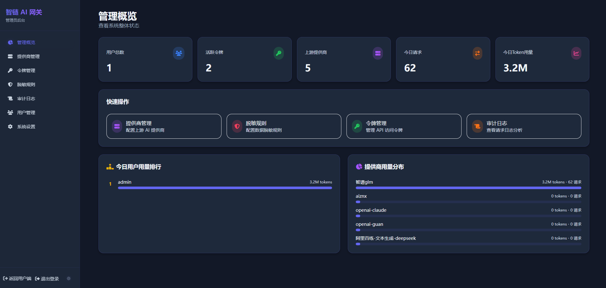
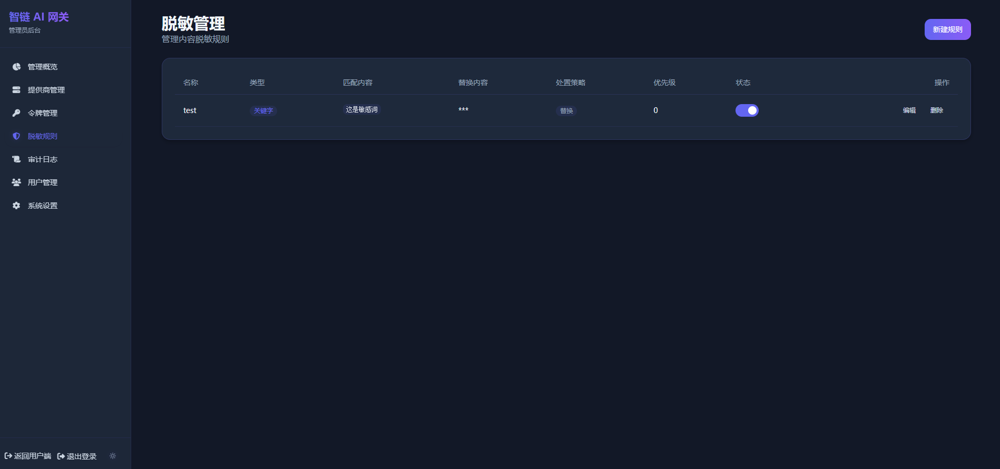

# 智链 AI 网关 | LinkAI Gateway

> **保护每一次 AI 调用的隐私安全** — 面向企业和个人的大模型安全接入网关

智链 AI 网关在统一代理转发大模型 API 的基础上，内置**数据脱敏、隐私保护、全链路审计**三大安全能力，确保敏感信息不泄露、每次调用可追溯。支持 OpenAI、Anthropic、Azure、通义千问、DeepSeek 等主流提供商，三态熔断器保障高可用。





## 🛡️ 核心亮点

- **双层脱敏引擎** — 管理员全局强制脱敏 + 用户自定义规则，关键字/正则匹配，敏感数据在请求发出前自动替换，**绝不会到达上游提供商**
- **链式哈希审计日志** — 每条审计日志通过哈希链关联，防篡改防删除，完整记录请求/响应，满足合规审查需求
- **零信任令牌体系** — 每个成员独立令牌，分层配额管控，超额自动熔断，兼顾安全管控与灵活使用
- **全链路容灾自愈** — 三态熔断器 + 健康探测 + 自动切换备用提供商，AI 调用稳定不掉线
- **多协议原生透传** — 支持 OpenAI 兼容、Anthropic 原生协议，业务端零改造接入

## 🚀 功能一览

| 能力 | 说明 |
|------|------|
| 统一代理转发 | 对外暴露 OpenAI 兼容 API，替换 `base_url` 和 `api_key` 即可接入 |
| 多提供商支持 | OpenAI、Azure OpenAI、Anthropic、通义千问、DeepSeek 等，内置协议适配器 |
| 数据脱敏 | 双层引擎，支持关键字/正则匹配，请求发出前自动替换敏感信息 |
| 审计日志 | 链式哈希防篡改，完整请求/响应记录，合规可追溯 |
| 配额管控 | 用户 > 令牌 > 提供商，多层级用量管控，超额自动熔断 |
| 容灾自愈 | 三态熔断器 + 健康探测 + 自动故障转移 |
| 多角色权限 | 超级管理员 + 普通用户，分层管控 |
| 轻量部署 | SQLite + Docker 一键部署，无需外部中间件 |

## 🔧 技术栈

Next.js 15 (App Router) · React 19 · TypeScript 5 · Tailwind CSS 3 · Prisma ORM · SQLite (WAL) · NextAuth.js · Vitest · Docker

## 📦 安装与部署

### Docker 一键部署（推荐）

```bash
# x86/x64
docker run -d --name link-ai --restart always -p 3333:3333 -v ~/link-ai_data:/app/data star7th/link-ai:latest

# ARM（树莓派、Apple Silicon）
docker run -d --name link-ai --restart always -p 3333:3333 -v ~/link-ai_data:/app/data star7th/link-ai:arm-latest
```

首次访问会引导创建管理员账户。

### Docker Compose

```bash
git clone https://github.com/star7th/link-ai.git && cd link-ai
docker compose up -d
```

### 开发环境

```bash
npm install && cp .env.example .env && npm run dev
```

访问 http://localhost:3333

## 🔄 更新说明

### Docker 部署更新

```bash
# 1. 停止当前容器
docker stop link-ai

# 2. 删除旧容器（数据会保留在挂载的卷中）
docker rm link-ai

# 3. 拉取最新镜像
docker pull star7th/link-ai:latest

# 4. 重新运行容器
docker run -d --name link-ai --restart always -p 3333:3333 -v ~/link-ai_data:/app/data star7th/link-ai:latest
```

## 🧩 项目结构

```
src/
├── app/                    # 页面与 API（dashboard / admin / auth / api）
├── components/             # UI 组件
├── lib/
│   ├── proxy/              # 代理转发引擎（engine / stream / adapter）
│   ├── desensitize/        # 脱敏引擎
│   ├── failover/           # 容灾引擎（熔断器、健康探测）
│   ├── quota/              # 配额引擎
│   └── audit/              # 审计引擎
└── types/                  # TypeScript 类型
```

## 🤝 贡献

欢迎 PR！Fork → 分支开发 → 提交 PR。

## 📄 许可证

[Apache License 2.0](LICENSE)

## 🔗 链接

GitHub: https://github.com/star7th/link-ai
